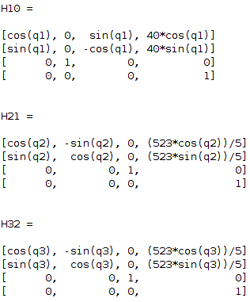

# Laboratorio 4.
## Robótica - Universidad Nacional De Colombia - Sede Bogotá.
### Sebastian Cubides - Julián Velandia.
***
### Mediciones:
Para la toma de mediciones se utilizó un calibrador pie de rey y el PhantomX disponibles en laboratorio. 

Se  tomaron las medidas de los 4 eslabones y se obtenieron los siguientes datos:
        
        L1 = 40mm
        L2 = 104.6mm
        L3 = 104.6mm
        L4 = 91mm
 
 
Cabe hacer la anotación de que el diagrama que está presente en la guía de laboratotorio difiere del recién presentado, dado que el primero, representa las dos primeras articulaciones como una sola, omitiendo un eslabón.

***
### Análisis:
En esta sección realizamos el análisis de Denavit Hartenberg (DHstd), obteniendo una representación para los sistemas coordenados de para cada articulación como se muestra en la siguiente imágen:

 
 
 Y luego hallamos los parámetros del DHstd:

    Theta_i : q1, q2, q3, q4
    d_i: L1, 0, 0, 0
    a_i: 0, L2, L3, 0
    Alfa_i: 90, 0, 0, 90
    Offset: 0, -90*, 0, 90
    * Se coloca el offset de -90 para la articulación 2 pero no se considerará en el toolbox.

***
### Toolbox:

En esta sección se comprobó el análisis cinemático del robot usando el Toolbox de Peter Corke para Matlab.

A continuación se muestra una imágen de la gráfica obtenida para el robot en la posición estudiada.

 

 Y ahora presentamos el robot en la posición de Home original y en otra posición planteada.

 

 Home

 
 Posición Alternativa

Ahora vemos las matrices de transformación homogéneas calculadas para cada uno de los eslabones en la posición estudiada.

La MTH simbólica del TCP con respecto a la base es muy grande, por lo cual presentamos a continuación la matriz evaluada en el vector q = [0 0 0 0].

En el archivo DH.m se encuentra todo el desarrollo computacional realizado.

***
### PYTHON + ROS:

En esta última etapa del desarrollo del laboratorio se programó un script en python capáz de llevar al robot a diferentes posturas con base en una entrada del teclado. Cuando se ingresa la tecla 'h', el robot va a Home [0 0 0 0] y de igual forma se programaron las poses 2, 3, 4 y 5 planteadas en la guía con esos mismos números. Para la ejecución de cada una de las poses se usó la función JointTrayectoryPoint().

El archivo lab4.py se encuentra adjunto en el repositorio y en el siguiente video se evidencia el funcionamiento de lo anteriormente mencionado.

VIDEO.

***
### Conclusiones:
* Es importante verificar el ID de cada motor antes de realizar la programación.
* Los ángulos para los parámetros de articulación se deben ingresar en radianes o de lo contrario el robot hará un movimiento sumamente brusco.

***
### Referencias:
1. Laboratorio 4 - Cinematica Directa - Phantom X - ROS - 2022-2. Universidad Nacional de Colombia.
2. https://github.com/fegonzalez7/rob_unal_clase3 
3. https://github.com/felipeg17/px_robot  
